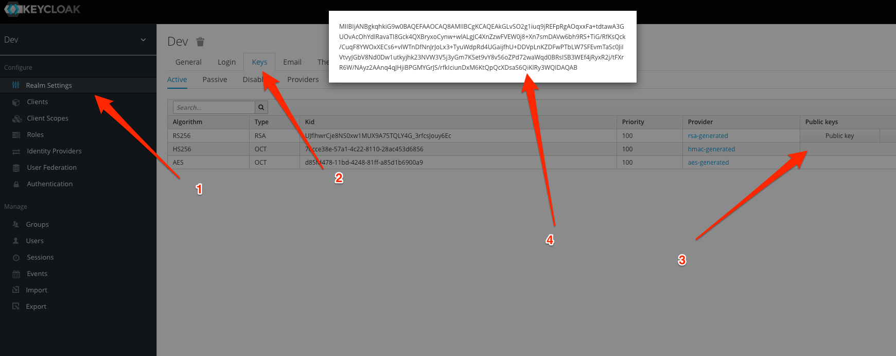
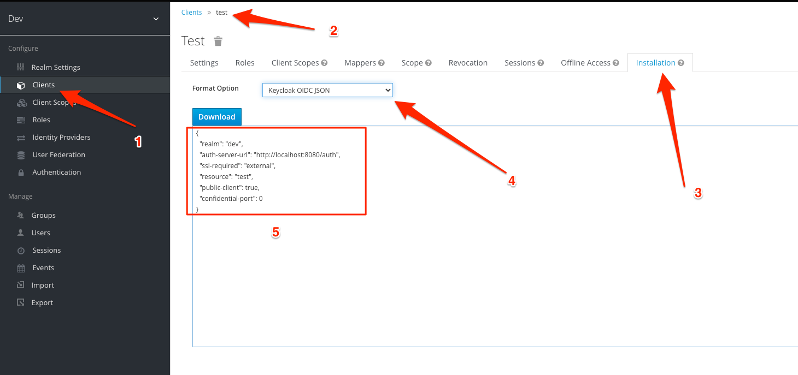

找了下,git 上面没有PHP整合 keycloak 的例子,就写了一个

# 使用方法

更新 test.php 中的 $public_key_str 和 $config_json




然后执行 test.php 中的测试用例,就可以看到解析 jwt 后的结果

## 获取 token 的地址  
```shell script
curl --location --request POST '{{host}/auth/realms/{{realm}}/protocol/openid-connect/token' \
--header 'Content-Type: application/x-www-form-urlencoded' \
--data-urlencode 'username={{username}}' \
--data-urlencode 'password={{password}}' \
--data-urlencode 'client_id={{client}}' \
--data-urlencode 'grant_type=password'
```
参考资料:
https://stackoverflow.com/questions/62631223/keycloak-validating-access-token-using-php

